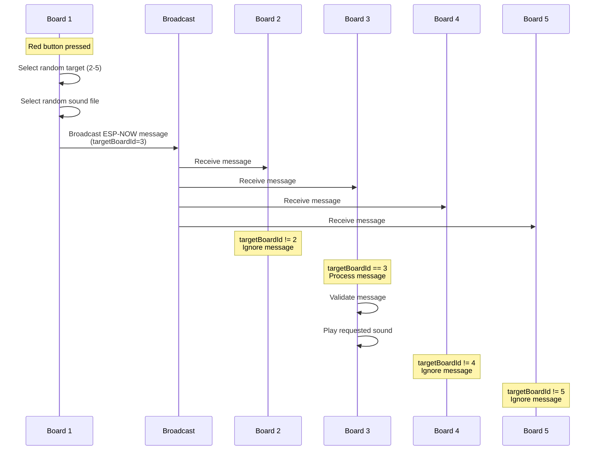
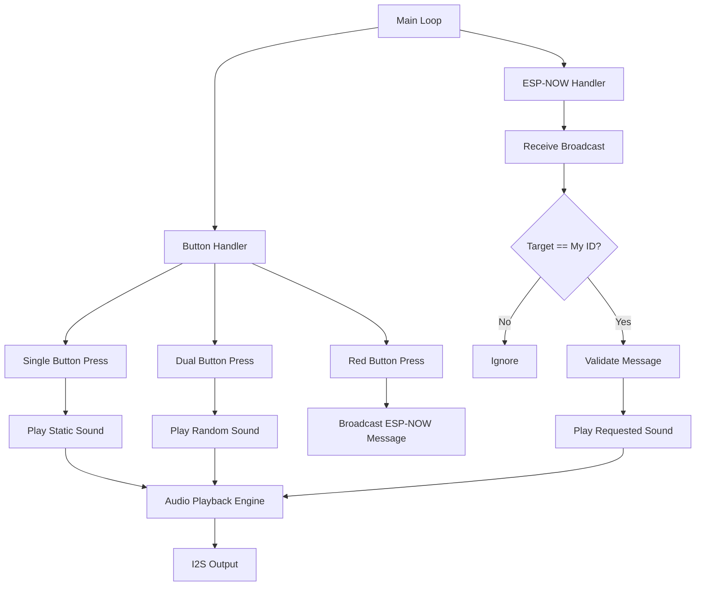

# Sound Board System Architecture

## Overview

A distributed sound board system using 5 ESP32-C3 boards with wireless ESP-NOW communication. Each board can play sounds locally via button presses and trigger remote sound playback on other boards using broadcast messaging.

## Hardware Configuration

### Components per Board

- Seeed Studio XIAO ESP32-C3
- Adafruit MAX98357A I2S 3W Class D Amplifier
- Adafruit MicroSD Card Breakout Board+
- Mono Enclosed Speaker (3W 4 Ohm)
- 4 Momentary Buttons (Red, Green, Blue, Yellow)

### Pin Assignments

```
SD Card:
- CS:   GPIO5  (D3)
- MOSI: GPIO4  (D2)
- MISO: GPIO3  (D1)
- SCK:  GPIO2  (D0)

I2S Audio (MAX98357A):
- DOUT: GPIO21 (D6)
- BCLK: GPIO20 (D7)
- LRC:  GPIO8  (D8)

Buttons:
- Red:    GPIO6  (D4)
- Blue:   GPIO7  (D5)
- Green:  GPIO9  (D9)
- Yellow: GPIO10 (D10)
```

## System Architecture

### Board Configuration

Each of the 5 boards will have:

- **Unique Board ID**: 1-5 (compile-time constant)
- **Broadcast Mode**: All boards listen to broadcast messages
- **Message Filtering**: Each board processes only messages addressed to it
- **Sound Configuration**: 3 static sound file mappings (Green, Blue, Yellow buttons)

### Audio Files

- **Format**: WAV files (16-bit, 44.1kHz stereo)
- **Location**: Root directory of SD card
- **Naming**: Descriptive names (e.g., `blue_meanie.wav`, `laugh_track.wav`)
- **Quantity**: ~15-20 files per board
- **Identical Content**: All 5 SD cards contain the same files

## Button Functionality

### Single Button Press

| Button | Action                                                         |
| ------ | -------------------------------------------------------------- |
| Green  | Play statically configured sound file                          |
| Blue   | Play statically configured sound file                          |
| Yellow | Play statically configured sound file                          |
| Red    | Broadcast ESP-NOW message to random board to play random sound |

### Dual Button Press

Pressing any two of Green, Blue, or Yellow simultaneously:

- Plays a **random sound** from all available WAV files on SD card
- Local playback only (no wireless transmission)

Valid combinations:

- Green + Blue
- Green + Yellow
- Blue + Yellow

## ESP-NOW Communication

### Broadcast Architecture

**Key Advantage**: No MAC address management required!

```cpp
// ESP-NOW broadcast address (all boards receive)
uint8_t broadcastAddress[] = {0xFF, 0xFF, 0xFF, 0xFF, 0xFF, 0xFF};
```

All boards:

1. Register the broadcast address as a peer
2. Send messages to broadcast address
3. Receive all broadcast messages
4. Filter messages by `targetBoardId`
5. Process only messages addressed to them

### Message Protocol

```cpp
struct ESPNowMessage {
    uint8_t senderBoardId;    // Sender's board ID (1-5)
    uint8_t targetBoardId;    // Recipient's board ID (1-5)
    char soundFile[64];       // Filename to play (null-terminated)
    uint32_t timestamp;       // Message timestamp for deduplication
    uint8_t checksum;         // Simple checksum for validation
};
```

### Communication Flow



### Message Filtering Logic

```cpp
void onDataReceive(const uint8_t *mac, const uint8_t *data, int len) {
    ESPNowMessage msg;
    memcpy(&msg, data, sizeof(msg));

    // Filter: Only process messages for this board
    if (msg.targetBoardId != BOARD_ID) {
        return; // Ignore messages for other boards
    }

    // Validate and process message
    if (validateMessage(&msg)) {
        playSound(msg.soundFile);
    }
}
```

## PlatformIO Configuration

### Build Environments

Five separate build environments in [`platformio.ini`](platformio.ini):

```ini
[env:board1]
platform = espressif32
board = seeed_xiao_esp32c3
framework = arduino
monitor_speed = 115200
build_flags =
    -DCORE_DEBUG_LEVEL=0
    -DBOARD_ID=1
    -DGREEN_SOUND=\"sound1.wav\"
    -DBLUE_SOUND=\"sound2.wav\"
    -DYELLOW_SOUND=\"sound3.wav\"

[env:board2]
platform = espressif32
board = seeed_xiao_esp32c3
framework = arduino
monitor_speed = 115200
build_flags =
    -DCORE_DEBUG_LEVEL=0
    -DBOARD_ID=2
    -DGREEN_SOUND=\"sound4.wav\"
    -DBLUE_SOUND=\"sound5.wav\"
    -DYELLOW_SOUND=\"sound6.wav\"

[env:board3]
platform = espressif32
board = seeed_xiao_esp32c3
framework = arduino
monitor_speed = 115200
build_flags =
    -DCORE_DEBUG_LEVEL=0
    -DBOARD_ID=3
    -DGREEN_SOUND=\"sound7.wav\"
    -DBLUE_SOUND=\"sound8.wav\"
    -DYELLOW_SOUND=\"sound9.wav\"

[env:board4]
platform = espressif32
board = seeed_xiao_esp32c3
framework = arduino
monitor_speed = 115200
build_flags =
    -DCORE_DEBUG_LEVEL=0
    -DBOARD_ID=4
    -DGREEN_SOUND=\"sound10.wav\"
    -DBLUE_SOUND=\"sound11.wav\"
    -DYELLOW_SOUND=\"sound12.wav\"

[env:board5]
platform = espressif32
board = seeed_xiao_esp32c3
framework = arduino
monitor_speed = 115200
build_flags =
    -DCORE_DEBUG_LEVEL=0
    -DBOARD_ID=5
    -DGREEN_SOUND=\"sound13.wav\"
    -DBLUE_SOUND=\"sound14.wav\"
    -DYELLOW_SOUND=\"sound15.wav\"
```

**Note**: Sound file names are examples. You'll configure actual filenames based on your audio files.

## Software Architecture

### Main Components



### Module Breakdown

#### 1. Button Management Module

- **Debouncing**: 50ms debounce time
- **Multi-press Detection**: 100ms window for dual button detection
- **State Machine**: Track button states and combinations

#### 2. Sound File Management Module

- **File Discovery**: Scan SD card for WAV files at startup
- **File List**: Maintain array of available sound files
- **Random Selection**: Use `esp_random()` for true random selection
- **Static Mapping**: Map button IDs to configured sound files

#### 3. ESP-NOW Communication Module

- **Initialization**: Set up WiFi in STA mode, initialize ESP-NOW
- **Broadcast Peer**: Register broadcast MAC address (FF:FF:FF:FF:FF:FF)
- **Message Sending**: Broadcast messages with target board ID
- **Message Receiving**: Callback-based reception with ID filtering
- **Error Handling**: Log errors, fire-and-forget delivery

#### 4. Audio Playback Module

- **I2S Configuration**: Existing working configuration
- **Volume Control**: Existing soft-limiting algorithm
- **Buffer Management**: Existing DMA buffer handling
- **Playback Queue**: Single-item queue (interrupt current playback)

## Implementation Details

### ESP-NOW Initialization

```cpp
void setupESPNow() {
    // Set device as WiFi Station
    WiFi.mode(WIFI_STA);

    // Initialize ESP-NOW
    if (esp_now_init() != ESP_OK) {
        Serial.println("Error initializing ESP-NOW");
        return;
    }

    // Register broadcast peer
    esp_now_peer_info_t peerInfo = {};
    memcpy(peerInfo.peer_addr, broadcastAddress, 6);
    peerInfo.channel = 0;
    peerInfo.encrypt = false;

    if (esp_now_add_peer(&peerInfo) != ESP_OK) {
        Serial.println("Failed to add broadcast peer");
        return;
    }

    // Register receive callback
    esp_now_register_recv_cb(onDataReceive);

    Serial.printf("ESP-NOW initialized for Board %d\n", BOARD_ID);
}
```

### Button Debouncing Algorithm

```cpp
struct ButtonState {
    uint8_t pin;
    bool currentState;
    bool lastState;
    unsigned long lastDebounceTime;
    bool pressed;
};

const unsigned long DEBOUNCE_DELAY = 50;
const unsigned long DUAL_PRESS_WINDOW = 100;

void updateButton(ButtonState* btn) {
    bool reading = digitalRead(btn->pin) == LOW; // Active LOW

    if (reading != btn->lastState) {
        btn->lastDebounceTime = millis();
    }

    if ((millis() - btn->lastDebounceTime) > DEBOUNCE_DELAY) {
        if (reading != btn->currentState) {
            btn->currentState = reading;
            btn->pressed = reading;
        }
    }

    btn->lastState = reading;
}
```

### Random Sound Selection

```cpp
String getRandomSound() {
    if (soundFileCount == 0) return "";
    uint32_t randomIndex = esp_random() % soundFileCount;
    return soundFiles[randomIndex];
}

uint8_t getRandomBoardId() {
    // Select random board ID (1-5) excluding this board
    uint8_t targetId;
    do {
        targetId = (esp_random() % 5) + 1;
    } while (targetId == BOARD_ID);
    return targetId;
}
```

### ESP-NOW Message Handling

```cpp
void sendSoundCommand(uint8_t targetBoard, const char* soundFile) {
    ESPNowMessage msg;
    msg.senderBoardId = BOARD_ID;
    msg.targetBoardId = targetBoard;
    strncpy(msg.soundFile, soundFile, sizeof(msg.soundFile) - 1);
    msg.soundFile[sizeof(msg.soundFile) - 1] = '\0';
    msg.timestamp = millis();
    msg.checksum = calculateChecksum(&msg);

    esp_err_t result = esp_now_send(broadcastAddress,
                                     (uint8_t*)&msg,
                                     sizeof(msg));

    if (result == ESP_OK) {
        Serial.printf("Sent to Board %d: %s\n", targetBoard, soundFile);
    } else {
        Serial.printf("Send failed: %s\n", esp_err_to_name(result));
    }
}

void onDataReceive(const uint8_t *mac, const uint8_t *data, int len) {
    if (len != sizeof(ESPNowMessage)) {
        Serial.println("Invalid message size");
        return;
    }

    ESPNowMessage msg;
    memcpy(&msg, data, sizeof(msg));

    // Filter by target board ID
    if (msg.targetBoardId != BOARD_ID) {
        return; // Not for us
    }

    Serial.printf("Received from Board %d: %s\n",
                  msg.senderBoardId, msg.soundFile);

    // Validate and play
    if (validateMessage(&msg)) {
        playWAVFile(msg.soundFile);
    } else {
        Serial.println("Invalid message");
    }
}

bool validateMessage(const ESPNowMessage* msg) {
    // Check board ID range
    if (msg->senderBoardId < 1 || msg->senderBoardId > 5) return false;
    if (msg->targetBoardId < 1 || msg->targetBoardId > 5) return false;

    // Verify checksum
    uint8_t calculatedChecksum = calculateChecksum(msg);
    if (msg->checksum != calculatedChecksum) return false;

    // Check if file exists
    String filePath = "/" + String(msg->soundFile);
    if (!SD.exists(filePath)) {
        Serial.printf("File not found: %s\n", msg->soundFile);
        return false;
    }

    return true;
}

uint8_t calculateChecksum(const ESPNowMessage* msg) {
    uint8_t sum = 0;
    sum += msg->senderBoardId;
    sum += msg->targetBoardId;
    for (int i = 0; i < sizeof(msg->soundFile) && msg->soundFile[i]; i++) {
        sum += msg->soundFile[i];
    }
    return sum;
}
```

## Error Handling Strategy

### ESP-NOW Errors

- **Send Failure**: Log error with `esp_err_to_name()`, continue operation
- **Invalid Message Size**: Log and discard
- **Invalid Board ID**: Log and discard
- **Checksum Mismatch**: Log and discard

### Audio Errors

- **File Not Found**: Log error, continue listening for messages
- **SD Card Error**: Log error, attempt re-initialization once
- **I2S Error**: Log error with `esp_err_to_name()`, attempt recovery

### Button Errors

- **Stuck Button**: Timeout detection (5 seconds)
- **Multiple Simultaneous**: Priority handling (Red > Green > Blue > Yellow)

## Power and Performance

### Power Consumption

- **Idle**: ~80mA (WiFi active, listening for broadcasts)
- **Playing Audio**: ~200-300mA (speaker dependent)
- **Transmitting**: ~120mA (brief spikes)

### Memory Usage

- **ESP-NOW**: ~10KB
- **Sound File List**: ~2KB (15-20 files × 64 bytes)
- **Audio Buffers**: ~4KB (existing DMA buffers)
- **Total RAM**: ~16KB (well within ESP32-C3's 400KB)

### Latency

- **Button Press to Local Sound**: <50ms
- **Button Press to Remote Sound**: 100-200ms (broadcast + processing)
- **Dual Button Detection**: 100ms window

### Broadcast Advantages

- **No MAC Management**: No need to track or configure MAC addresses
- **Simplified Setup**: Same code for all boards (only BOARD_ID differs)
- **Easy Expansion**: Add more boards without reconfiguring existing ones
- **Robust**: No peer connection failures

## Testing Strategy

### Unit Testing

1. Button debouncing and multi-press detection
2. Sound file discovery and random selection
3. ESP-NOW message construction and validation
4. Board ID filtering logic
5. Audio playback with volume control

### Integration Testing

1. Single button press → local sound playback
2. Dual button press → random sound playback
3. Red button press → remote board sound playback
4. Broadcast message filtering (verify only target board responds)
5. Multiple simultaneous broadcasts
6. Error recovery scenarios

### System Testing

1. All 5 boards powered on and communicating
2. Rapid button presses on multiple boards
3. Simultaneous red button presses from multiple boards
4. Long-duration operation (thermal testing)
5. SD card removal/insertion scenarios
6. Power cycle recovery

## Deployment Checklist

### Per Board Setup

- [ ] Flash correct board environment (board1-board5)
- [ ] Format SD card as FAT32
- [ ] Convert all audio files to WAV (16-bit, 44.1kHz stereo)
- [ ] Copy identical audio files to all SD cards
- [ ] Test button functionality
- [ ] Verify audio output
- [ ] Verify board ID is correct (check serial output)

### System Setup

- [ ] Power on all 5 boards
- [ ] Verify each board reports correct ID on serial monitor
- [ ] Test local playback on each board (Green, Blue, Yellow buttons)
- [ ] Test dual button press on each board
- [ ] Test red button from each board to each other board
- [ ] Verify only target board plays sound
- [ ] Test multiple simultaneous broadcasts
- [ ] Document any issues or quirks

### Audio File Preparation

```bash
# Convert MP3 to WAV (16-bit, 44.1kHz stereo)
ffmpeg -i input.mp3 -ar 44100 -ac 2 -sample_fmt s16 output.wav

# Batch convert all MP3 files in directory
for file in *.mp3; do
    ffmpeg -i "$file" -ar 44100 -ac 2 -sample_fmt s16 "${file%.mp3}.wav"
done
```

## Future Enhancements

### Potential Features

1. **Volume Control**: Add potentiometer for adjustable volume
2. **Sound Categories**: Organize sounds into categories
3. **LED Feedback**: Visual indication of button presses and messages
4. **Battery Operation**: Add LiPo battery and charging circuit
5. **Web Interface**: Configure sounds via WiFi web server
6. **Broadcast to All**: Special mode to play sound on all boards
7. **Recording**: Record and store new sounds
8. **Message Acknowledgment**: Optional ACK for critical sounds

## Troubleshooting

### Common Issues

**Board not receiving messages:**

- Verify WiFi is initialized in STA mode
- Check ESP-NOW initialization succeeded
- Confirm broadcast peer is registered
- Verify board IDs are unique (1-5)

**Wrong board playing sound:**

- Check BOARD_ID compile flag
- Verify message filtering logic
- Check serial output for received messages

**No sound output:**

- Verify SD card has correct WAV files
- Check file paths (must include leading `/`)
- Verify I2S configuration
- Check speaker connections

**Intermittent communication:**

- Check power supply (use wall adapter, not USB)
- Verify all boards on same WiFi channel
- Check for WiFi interference
- Reduce distance between boards if needed

## References

- [ESP-NOW Documentation](https://docs.espressif.com/projects/esp-idf/en/latest/esp32c3/api-reference/network/esp_now.html)
- [ESP-NOW Broadcast Example](https://randomnerdtutorials.com/esp-now-esp32-arduino-ide/)
- [MAX98357A Datasheet](https://www.analog.com/media/en/technical-documentation/data-sheets/MAX98357A-MAX98357B.pdf)
- [ESP32-C3 Technical Reference](https://www.espressif.com/sites/default/files/documentation/esp32-c3_technical_reference_manual_en.pdf)
- [I2S Audio on ESP32](https://docs.espressif.com/projects/esp-idf/en/latest/esp32c3/api-reference/peripherals/i2s.html)
